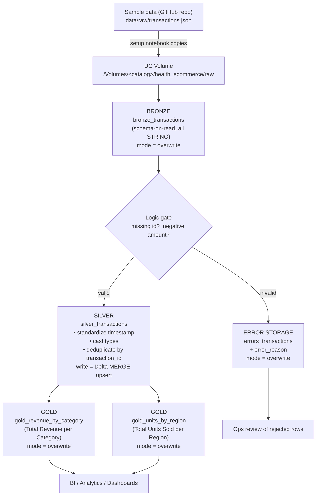

# Architecture

## Medallion overview

Both implementations follow the same Bronze → Silver → Gold (medallion) design.
Raw data lands in a Unity Catalog **Volume**; curated tables are managed Delta
tables in Unity Catalog.

## Two implementations, one architecture

| Aspect            | PySpark notebooks (`notebooks/pyspark/`)        | Declarative pipeline (`declarative_pipeline/`)         |
|-------------------|-------------------------------------------------|--------------------------------------------------------|
| Orchestration     | Imperative — you run notebooks / `run_pipeline` | Declarative — Lakeflow builds the DAG from `@dlt.table`|
| Bronze            | `overwrite` snapshot                            | materialized view                                      |
| Logic gate        | `split_valid_invalid()` → errors table          | explicit `errors_transactions` + `@dlt.expect_or_drop` |
| Silver write      | Delta **MERGE** upsert on `transaction_id`      | materialized view (full recompute)                     |
| Gold              | `overwrite` from Silver                          | materialized views                                     |
| Idempotency       | overwrite + MERGE                               | full recompute every update                            |

## Idempotency strategy (Requirement #4)

Re-running on the same input must not create duplicate rows in the final tables.

- **Bronze / Errors / Gold** — written with `overwrite` (notebooks) or recomputed
  as materialized views (declarative). The table contents are replaced
  wholesale, so re-runs are naturally idempotent.
- **Silver (notebooks)** — written with a Delta `MERGE` keyed on
  `transaction_id`. Existing transactions are updated in place; new ones are
  inserted. Row count is stable across identical re-runs.
- **Deduplication** happens *before* the Silver write (one row per
  `transaction_id`, latest event wins), so duplicate source rows never reach the
  curated layer.

## Data quality / error handling (Requirement #1)

A record is quarantined when **either**:
- `transaction_id` is `NULL` or blank, **or**
- `amount` is negative.

Quarantined rows are written to `errors_transactions` with an `error_reason`
column. The valid rows continue to Silver/Gold and the pipeline completes
successfully — bad data never fails the run.
